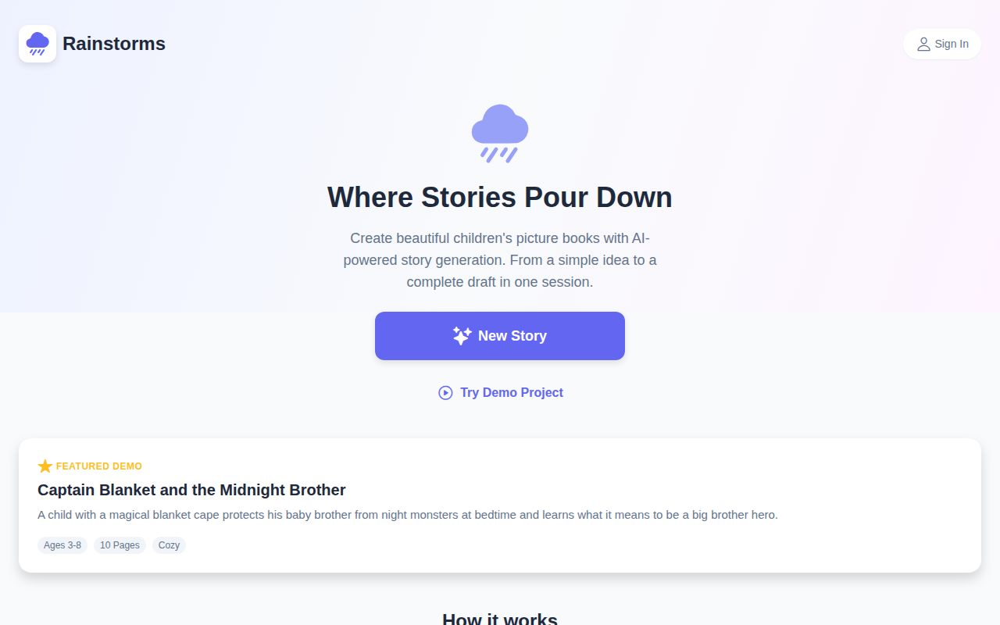
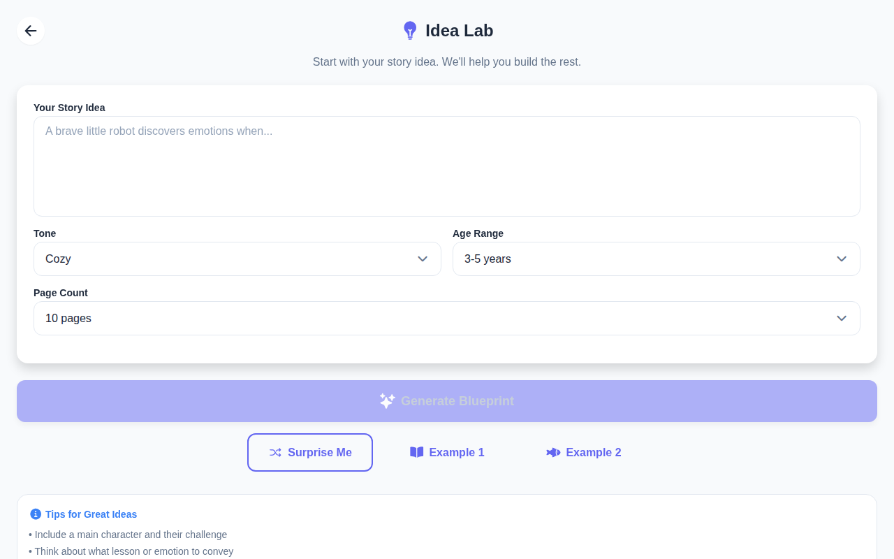
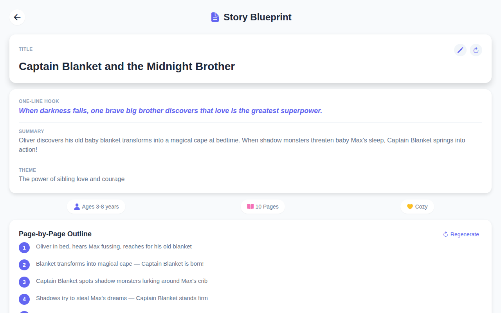
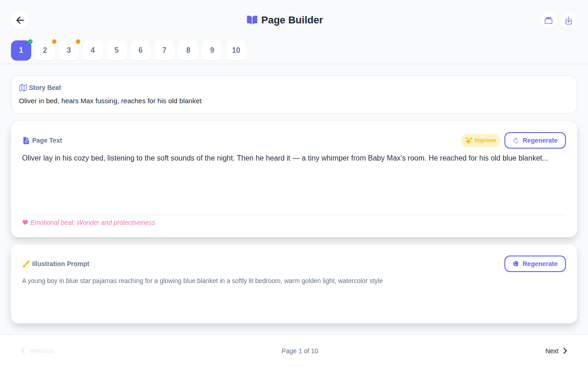
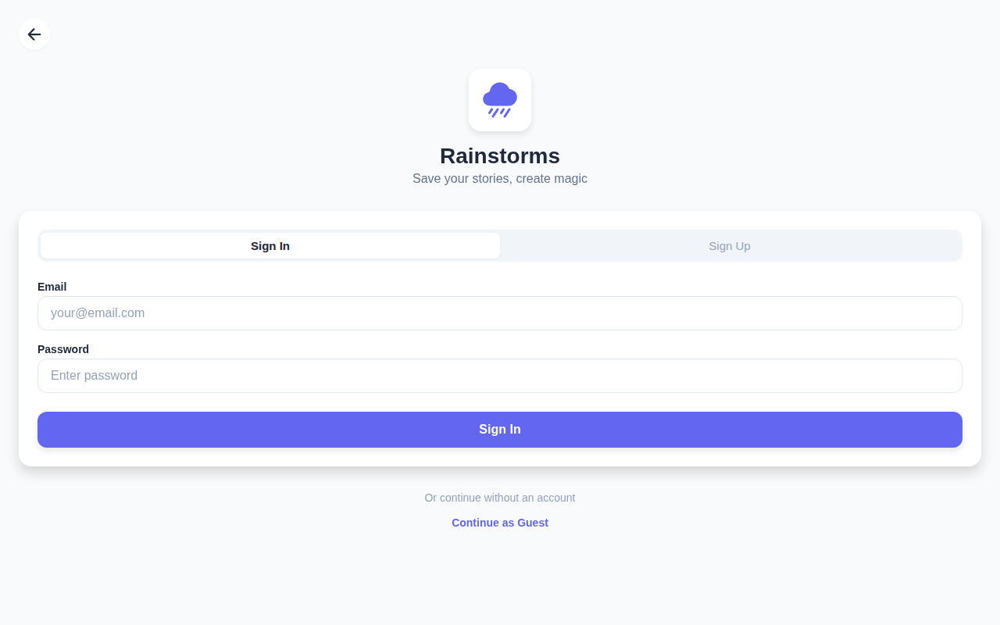

<div align="center">

# 🌧️ Rainstorms

### **Where Stories Pour Down**

**Turn a one-sentence story idea into a complete children's picture-book draft in a single session.**

[](LICENSE)
[](frontend/)
[](backend/)
[](https://github.com/Bboy9090/Rainstorms/releases/tag/v0.1.0)

</div>

---

## What is Rainstorms?

Rainstorms is an AI-powered children's book creation tool. Give it an idea — *"a brave little robot discovers emotions"* — and it generates a full story blueprint, named characters with personalities and visual descriptions, page-by-page text, and illustration prompts ready for an artist or image-generation tool. Export everything as a polished PDF in under 30 minutes.

---

## Screenshots

| Home | Idea Lab | Story Blueprint |
|------|----------|-----------------|
|  |  |  |

| Page Builder | Sign In |
|--------------|---------|
|  |  |

---

## Features

| Feature | Description |
|---------|-------------|
| 💡 **Idea Lab** | Enter your story concept, tone, age range, and page count |
| 📋 **Story Blueprint** | AI generates title, one-line hook, summary, theme, and a page-by-page outline |
| 🧑‍🤝‍🧑 **Character Forge** | Editable character cards with personality, appearance, and special traits |
| 📖 **Page Builder** | Generate page text and illustration prompts per page; Improve with one-click modifiers (funnier, cozier, simpler…) |
| 🧠 **Story Memory** | Consistency tracker keeps characters, settings, and tone coherent across all pages |
| 📤 **Export** | Download your book as a story PDF, prompts PDF, plain text, or JSON |
| 🚀 **Demo Project** | Pre-loaded *"Captain Blanket and the Midnight Brother"* — try the full flow instantly, no account needed |
| 🔐 **Auth (optional)** | Register/login to save projects; or continue as a guest |

---

## Tech Stack

| Layer | Technology |
|-------|-----------|
| Frontend | React Native + Expo (web, iOS, Android) |
| Navigation | Expo Router (file-based) |
| Backend | FastAPI (Python 3.10+) |
| Database | MongoDB (motor async driver) |
| AI (text) | OpenAI GPT-4.1 **or** Google Gemini 2.0 Flash (your own API key) |
| AI (images) | OpenAI DALL-E 3 (your own OpenAI API key) |
| PDF | ReportLab |
| Auth | JWT (72-hour tokens) + bcrypt |

---

## Quick Start (local, ~10 minutes)

### Prerequisites

- **Python 3.10+** and **pip**
- **Node 18+** and **npm**
- **MongoDB** — local instance (`mongod`) **or** a free [MongoDB Atlas](https://www.mongodb.com/atlas) cluster
- An **OpenAI API key** (for AI text + image generation) — get one at [platform.openai.com/api-keys](https://platform.openai.com/api-keys)
  - *Alternatively*, a **Google Gemini API key** can be used for text generation — get one at [aistudio.google.com](https://aistudio.google.com/app/apikey)

### 1 — Clone and configure

```bash
git clone https://github.com/Bboy9090/Rainstorms.git
cd Rainstorms

# Backend config
cp backend/.env.example backend/.env
# Edit backend/.env — set MONGO_URL and OPENAI_API_KEY (and optionally GEMINI_API_KEY)

# Frontend config (defaults to localhost:8001 — no changes needed for local dev)
cp frontend/.env.example frontend/.env
```

### 2 — One-command startup

```bash
bash start.sh
```

This script:
1. Installs Python deps into `backend/.venv`
2. Installs Node deps in `frontend/`
3. Starts the FastAPI backend on **http://localhost:8001**
4. Starts the Expo web frontend on **http://localhost:8081**

Then open **http://localhost:8081** in your browser.

> **Want to try without AI keys?** Click **"Try Demo Project"** on the home screen — the full demo story is pre-loaded from the backend and requires no API calls.

---

## Manual Setup (step-by-step)

<details>
<summary>Click to expand</summary>

### Backend

```bash
cd backend
python3 -m venv .venv
source .venv/bin/activate          # Windows: .venv\Scripts\activate
pip install -r requirements.txt
cp .env.example .env               # fill in MONGO_URL and OPENAI_API_KEY
uvicorn server:app --host 0.0.0.0 --port 8001 --reload
```

API docs available at **http://localhost:8001/docs**

### Frontend

```bash
cd frontend
npm install --legacy-peer-deps
cp .env.example .env               # defaults are fine for local dev
npx expo start --web               # opens browser automatically
```

For mobile: scan the QR code with [Expo Go](https://expo.dev/go) (iOS/Android).

</details>

---

## Demo User Journey

> **No account or API key required** for the demo path.

1. Open **http://localhost:8081**
2. Click **"Try Demo Project"** → lands on the Story Blueprint
3. Read the title, hook, summary, theme, and 10-page outline
4. Click **"Accept Blueprint"** → Character Forge (view Oliver and Baby Max)
5. Navigate to **Page Builder** → page text and illustration prompts are pre-filled
6. Click **"Export"** → download the story PDF

---

## Build & Test

### Frontend lint + type-check

```bash
cd frontend
npm install --legacy-peer-deps
npx expo lint           # ESLint
```

### Frontend static web build

```bash
cd frontend
npx expo export --platform web   # outputs to frontend/dist/
```

### Backend API tests

```bash
# Requires a running backend (backend running on localhost:8001)
cd ..
python backend_test.py
```

All 22 tests should pass (health, auth, demo project, CRUD, AI generation, export, story memory).

---

## Project Structure

```
Rainstorms/
├── backend/
│   ├── server.py          # FastAPI app — all endpoints
│   ├── requirements.txt   # Python dependencies
│   └── .env.example       # Environment variable template
├── frontend/
│   ├── app/               # Expo Router screens (index, idea-lab, blueprint, …)
│   ├── src/
│   │   ├── components/    # Button, Card, Input, Loading, …
│   │   ├── context/       # AuthContext, ProjectContext
│   │   └── utils/         # api.ts, autosave.ts, theme.ts
│   ├── assets/            # Icons, fonts, images
│   └── .env.example       # Frontend env template
├── demo/
│   ├── captain_blanket_demo.json    # Full structured export (matches API schema)
│   ├── captain_blanket_outline.md  # Story outline and character profiles
│   └── captain_blanket_pages.md    # All 10 pages with illustration prompts
├── docs/
│   ├── APP_VISION.md      # Product philosophy
│   ├── DEMO_FLOW.md       # Captain Blanket walkthrough of the full pipeline
│   ├── DEMO_PROJECT.md    # Demo story background and series notes
│   ├── ROADMAP.md         # 5-phase product roadmap
│   └── STORY_ENGINE.md    # AI generation architecture and API endpoints
├── schemas/
│   ├── story_blueprint.schema.json    # Blueprint JSON schema
│   ├── character_profile.schema.json  # Character JSON schema
│   └── page_layout.schema.json        # Page JSON schema
├── screenshots/           # App store-style screenshots
├── scripts/
│   └── publish-release.sh # Post-merge release script (tag + GitHub release)
├── start.sh               # One-click local dev startup
└── backend_test.py        # Full API test suite
```

---

## Known Limitations (v0.1.0)

- **No image generation** — illustration *prompts* are created but actual images are not generated; bring your own image tool (Midjourney, DALL·E, etc.)
- **Guest sessions are not persisted** — work as a guest is stored only in browser memory; closing the tab loses your project unless you're signed in
- **API key costs** — `OPENAI_API_KEY` is used server-side for all AI generation; production deployments should implement per-user key management or rate limiting to control costs
- **No real-time collaboration** — one user edits a project at a time
- **PDF formatting** — the story PDF uses a basic ReportLab layout; custom fonts and illustrations require additional work
- **Mobile app stores** — not published to App Store or Google Play in this release; run via Expo Go or the web build

---

## MVP Scope (v0.1.0)

What's **in**:
- ✅ Full story generation pipeline (idea → blueprint → characters → pages → export)
- ✅ Story Memory consistency tracking
- ✅ "Improve This Page" modifiers (5 styles)
- ✅ PDF and text export
- ✅ Optional user accounts with JWT auth
- ✅ Pre-loaded demo project (no API key needed to explore)

What's **out** (planned for future versions):
- Series / sequel support
- AI illustration generation
- Voice narration export
- Publishing marketplace
- Real-time collaboration

---

## Deploying to Production

See **[docs/DEPLOYMENT.md](docs/DEPLOYMENT.md)** for the full production deployment guide, including:

- Recommended app type and hosting stack (Vercel + Railway + MongoDB Atlas)
- Step-by-step backend and frontend deployment
- Environment variable reference
- CORS hardening and rate limiting
- Mobile app store publishing via Expo EAS Build
- Estimated monthly costs

---

## Contributing

1. Fork the repo and create a feature branch
2. Follow the existing code style (TypeScript strict mode on frontend, FastAPI patterns on backend)
3. Run `npx expo lint` (frontend) and `python backend_test.py` (backend) before opening a PR
4. Open a pull request against `main` with a clear description

---

## License

[MIT](LICENSE) © 2024 Rainstorms
