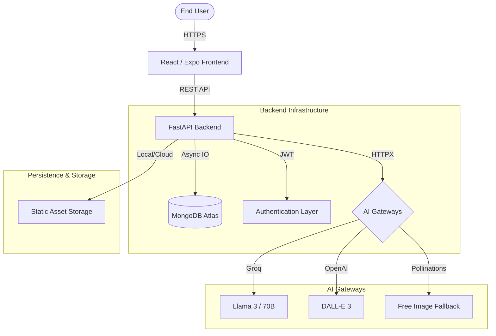

# Rainstorms Enterprise Architecture

This document describes the high-level architecture and engineering standards for the Rainstorms ecosystem.

## High-Level Overview

Rainstorms is a hybrid AI application designed for generating storytelling assets (books, characters, illustrations). It follows a monorepo pattern with two primary pillars:

1.  **Frontend**: React (Expo-based) optimized for Web and mobile-responsiveness. Managed via NPM Workspaces.
2.  **Backend**: High-performance Python (FastAPI) utilizing asynchronous task processing and MongoDB (Motor).

## System Architecture

## Engineering Standards

### 1. Configuration Management
Configuration is centralized in `backend/config.py` using Pydantic Settings. Development overrides should be placed in a `.env` file within the `backend/` directory.

### 2. Code Quality & Guardrails
- **Linters**: `Black` (Python formatting), `Flake8` (Python linting), `Prettier` (JS/TS formatting).
- **Hooks**: `Husky` pre-commit hooks enforce formatting before any code enters Git.
- **CI**: GitHub Actions validate every Pull Request with a suite of build and lint tests.

### 3. Deployment Pipeline
The application utilizes a multi-cloud strategy for high availability:
- **Web Frontend**: Vercel (Edge-optimized distribution).
- **API Backend**: Railway (Container-orchestrated with Docker).
- **Database**: MongoDB Atlas (Cloud-native document store).

## Security Model
- **Authentication**: Stateless JWT-based authentication.
- **Data Safety**: Pydantic models enforce strict schema validation for all API inputs.
- **Environment Safety**: Secrets are never hardcoded; they are injected via Railway/Vercel environment managers.

## Local Development Orchestration
Use the root `Makefile` for all local tasks:
- `make dev`: Start the full stack.
- `make lint`: Format and clean code.
- `make test`: Run backend tests.
